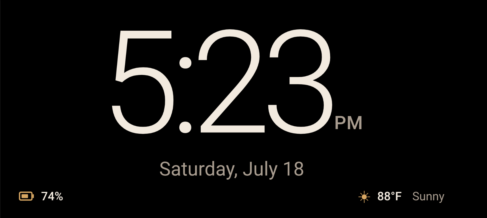

# Bedside Clock Card

A fullscreen Home Assistant bedside clock card with:

- large 12- or 24-hour time display;
- optional seconds and date;
- Home Assistant weather condition and temperature;
- per-phone battery display selected by `?device=...`;
- dark warm/cool presentation;
- subtle burn-in mitigation;
- a compact vertical layout sized for fullscreen phone displays.



## Installation through HACS

1. In HACS, open **Custom repositories**.
2. Add this GitHub repository as category **Dashboard**.
3. Install **Bedside Clock Card**.
4. Reload the browser or Home Assistant frontend when HACS requests it.

HACS installs `dist/bedside-clock-card.js` and registers the Lovelace module resource automatically. Do **not** add the card through `frontend.extra_module_url`, and do not manually create a duplicate Lovelace resource.

## Create the dashboard in the Home Assistant UI

The recommended setup uses a normal storage-mode dashboard created entirely through the Home Assistant UI.

### 1. Create a dedicated dashboard

1. Open **Settings → Dashboards**.
2. Select **Add dashboard**.
3. Create a new dashboard from scratch.
4. Use a title such as **Bedside Clock**.
5. Set the URL to something simple, such as `bedside-clock`.
6. Save the dashboard.

### 2. Configure its view

1. Open the new dashboard.
2. Select **Edit dashboard**.
3. If Home Assistant asks, select **Take control**.
4. Edit the view.
5. Set:
   - **Title:** `Clock`
   - **Path:** `clock`
   - **View type:** **Panel (1 card)**

Panel view allows the clock card to occupy the entire dashboard canvas.

### 3. Add the clock card

1. While still editing the dashboard, select **Add card**.
2. Choose **Manual**.
3. Paste a configuration like this:

```yaml
type: custom:bedside-clock-card
default_device: primary
time_format: "12"
show_seconds: false
show_date: true
show_weather_text: true
theme: warm
burn_in_shift: true

weather_entity: weather.home

devices:
  primary:
    battery: sensor.primary_phone_battery_level

  secondary:
    battery: sensor.secondary_phone_battery_level
```

Replace the example entity IDs with entities from your own Home Assistant installation.

### 4. Open the correct device display

For a dashboard URL of `bedside-clock` and a view path of `clock`, open:

```text
/bedside-clock/clock?device=primary
```

For the second configured device:

```text
/bedside-clock/clock?device=secondary
```

The `device` value must match a key under `devices:`. If it is absent or invalid, the card uses `default_device` when that key exists; otherwise it uses the first configured device.

## Options

| Option | Default | Meaning |
|---|---:|---|
| `default_device` | unset | Preferred device key when the query parameter is absent or invalid; otherwise the first configured device is used |
| `time_format` | `"12"` | `"12"` or `"24"` |
| `show_seconds` | `false` | Show seconds |
| `show_date` | `true` | Show the date |
| `show_weather_text` | `true` | Show textual weather condition |
| `theme` | `warm` | Visual theme used by the card |
| `burn_in_shift` | `true` | Slightly shifts the clock periodically |
| `weather_entity` | — | Home Assistant weather entity |
| `temperature_entity` | — | Optional separate temperature sensor |
| `devices` | `{}` | Map of device keys to battery entities |

## Fullscreen phone use

Home Assistant Kiosk Mode hides Home Assistant chrome but does not necessarily hide Android system bars. The recommended setup uses Fully Kiosk Browser only for the docked clock while leaving the normal Companion app unchanged. See [`examples/tasker-and-fully-kiosk.md`](examples/tasker-and-fully-kiosk.md).

## Advanced: YAML-managed dashboard

For a complete YAML-based alternative, see [`examples/yaml-dashboard.md`](examples/yaml-dashboard.md). It is not required for the recommended UI-based installation.

## Development

The distributable file must remain:

```text
dist/bedside-clock-card.js
```

The repository name should be `bedside-clock-card` so HACS can match the plugin filename. Run the included HACS validation workflow before creating a GitHub release.
